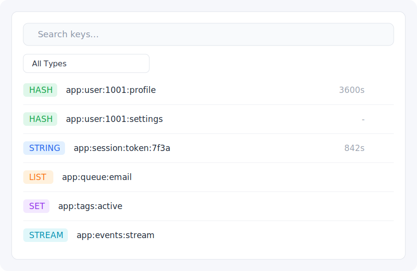
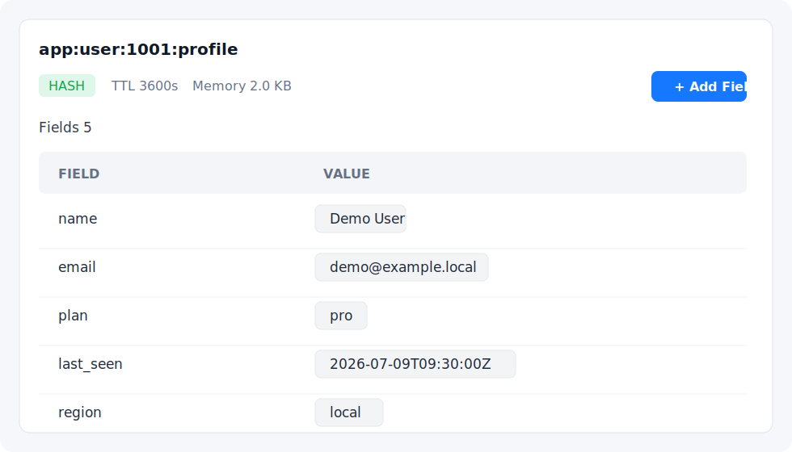
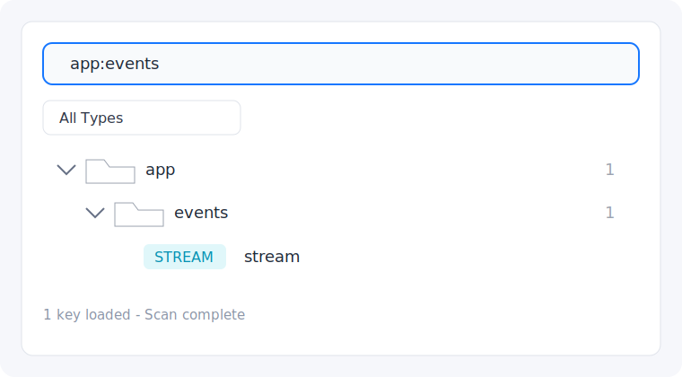
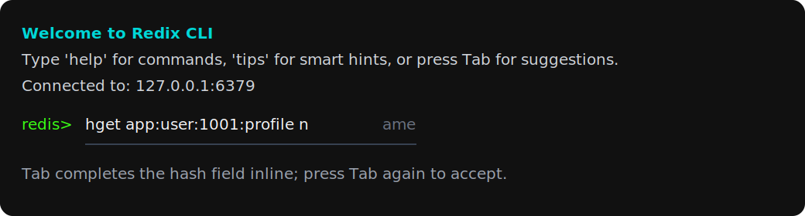
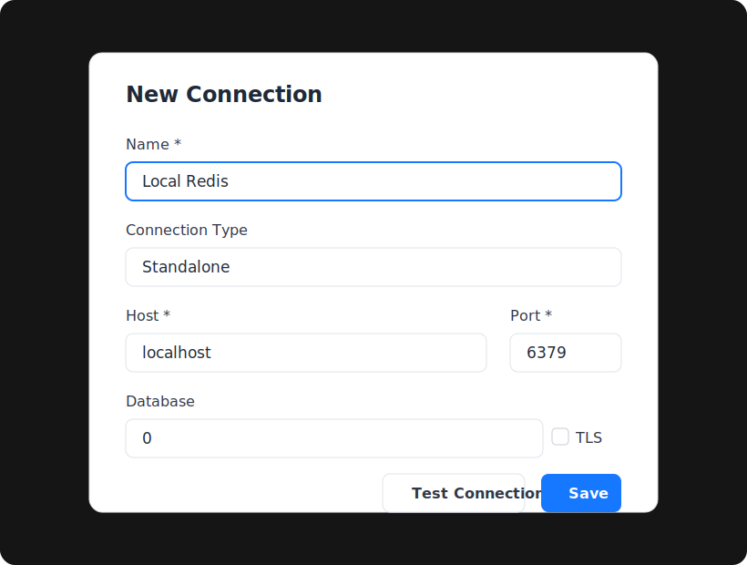

# Redix

[](https://github.com/qIsaac/Redix/actions/workflows/ci.yml)
[](LICENSE)

Redix is a modern Redis desktop client built with Tauri, React, TypeScript, and Rust.

It is designed for day-to-day Redis inspection and editing: browse keys, inspect values, run CLI commands, monitor server stats, and work with standalone, Sentinel, and Cluster deployments from a native desktop app.

## Features

- Native desktop app powered by Tauri 2.
- Redis standalone, Sentinel, and Cluster connection modes.
- TLS and password-protected connections.
- Key browser with list and tree views.
- Search by Redis glob pattern or plain keyword.
- Value viewers and editors for strings, hashes, lists, sets, sorted sets, and streams.
- Embedded Redis CLI with command hints and key-aware completion.
- Database selector, TTL editing, rename/delete flows, and quick key creation.
- Server metrics and slowlog views.
- macOS `.app` and `.dmg` build scripts.

## Screenshots

### Key Browser



### Value Editor



### Tree View



### Embedded CLI



### Connection Setup



## Requirements

- Node.js 20 or newer.
- npm 10 or newer.
- Rust stable toolchain.
- Platform requirements for Tauri 2.

For macOS builds, install Xcode Command Line Tools:

```bash
xcode-select --install
```

## Development

Clone the repository:

```bash
git clone https://github.com/qIsaac/Redix.git
cd Redix
```

Install dependencies:

```bash
npm ci
```

Run the desktop app in development mode:

```bash
npm run dev
```

Run the web frontend only:

```bash
npm run dev:web
```

## Checks

Run all local checks:

```bash
npm run check
```

Or run checks individually:

```bash
npm run typecheck
cargo check --manifest-path src-tauri/Cargo.toml
```

## Build

Build a macOS app bundle:

```bash
npm run build
```

Build a DMG:

```bash
npm run build:dmg
```

Build artifacts are written under:

```text
src-tauri/target/release/bundle/
```

Unsigned local builds are useful for development and internal testing. Public macOS distribution should use Developer ID signing and Apple notarization. See [docs/macos-distribution.md](docs/macos-distribution.md).

## Privacy And Local Data

Redix stores connection metadata locally. Passwords are stored in the system keychain when possible, with an encrypted local fallback.

Do not commit local app data, screenshots containing production keys, connection exports, or `.env` files.

## Project Structure

```text
frontend/              React UI, stores, components, editors, styles
src-tauri/             Tauri/Rust backend, Redis commands, app config
resources/             App icons and image resources
docs/                  Distribution and project documentation
scripts/               Release helper scripts
```

## Contributing

Contributions are welcome. Please read [CONTRIBUTING.md](CONTRIBUTING.md) before opening a pull request.

## Security

Please do not disclose security vulnerabilities publicly before maintainers have had a chance to respond. See [SECURITY.md](SECURITY.md).

## License

MIT. See [LICENSE](LICENSE).
